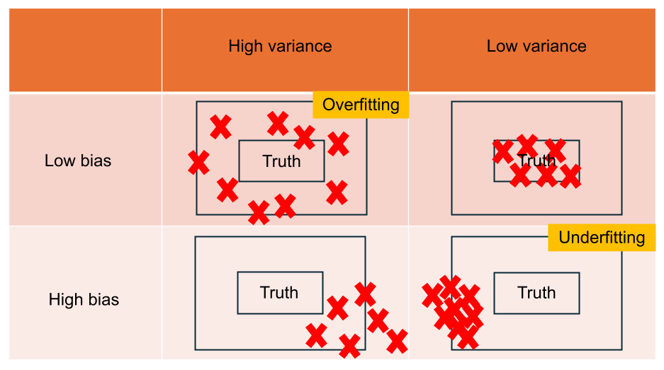
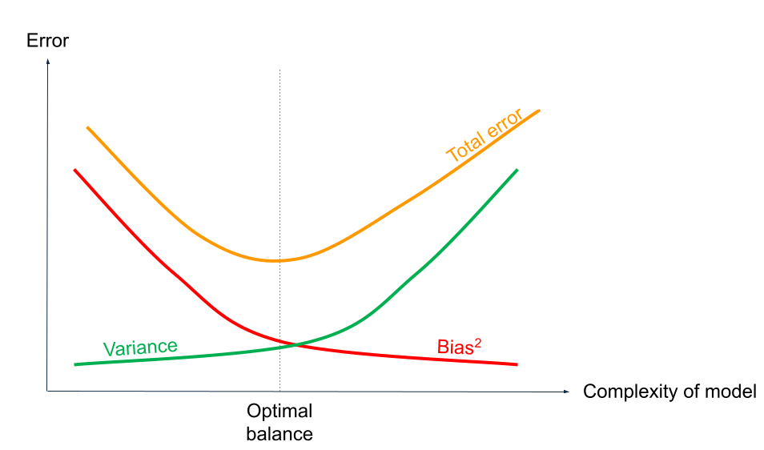

# Learning points

<h2>Correlation Analysis: Discovering the Strength of Associations</h2>

<h3>Interpreting Pearson Correlation Coefficient</h3>

<li>There is a <b>strong positive correlation</b> (0.64) between 'floor_area_sqm' and 'resale_price', suggesting that larger floor areas are associated with higher resale prices.</li>

<li>There is a <b>moderate positive correlation</b> (0.34) between 'lease_commence_date' and 'resale_price', indicating that properties with longer remaining leases tend to have higher resale prices.</li>

 
<h3>Limitations of Pearson Correlation Coefficient</h3>

<h4>Designed for Continuous Variables</h4>

You may have realised that we only implemented Pearson correlation with the continuous variables in the data. This is because Pearson correlation is specifically designed for use with continuous variables. Pearson correlation uses the mean to calculate how each data point deviates from the average, which is essential for determining the linear relationship between the variables. This calculation assumes that the data points are continuous and can take on any value within a range, making the mean a meaningful and informative measure.

Using Pearson correlation with other types of variables, such as ordinal or categorical variables, can lead to misleading or incorrect results. Ordinal or categorical variables do not have a meaningful average in the same way continuous variables do. For example, averaging ranks or categories can lead to misleading interpretations, as these data types represent distinct, non-numeric differences rather than a continuum of values.

 
<h4>Linear Relationship Assumption</h4>

Pearson's correlation assumes that the relationship between the variables is linear. It may not accurately capture the strength or direction of non-linear relationships. For example, a perfect quadratic relationship may result in a low Pearson correlation coefficient.

<h4>Normality Assumption</h4>

The Pearson correlation assumes that the data is normally distributed. When this assumption is violated, the correlation coefficient may not accurately reflect the true relationship between the variables.

<h4>Homogeneity of Variance</h4>

Pearson's correlation assumes that the spread or variance of the data points is constant across the entire range of values (this is called homoscedasticity). Think of it like having a basketball court where the floor is perfectly flat.

If the floor is flat, it is easy to measure distances accurately. However, if the floor has bumps and dips (this is called heteroscedasticity), measuring distances becomes tricky and unreliable.

Similarly, when data points have different spreads at different levels, the correlation measurement might not be accurate. When the data shows heteroscedasticity (i.e., the variance changes at different levels of the variables), it would be like trying to measure straight-line distances on a bumpy surface – your results might not truly represent the reality.

<h4>Sensitivity to Outliers</h4>

Pearson's correlation is sensitive to outliers. Extreme values can disproportionately influence the correlation coefficient, leading to misleading results. Even a few outliers can significantly distort the measure of the overall relationship between the variables.

<h3>Interpreting Spearman Rank Correlation Coefficient</h3>

<li>There is a <b>strong positive monotonic correlation</b> between the 'floor_area' and the 'resale_price'. Larger flats tend to have higher resale prices, and this relationship is relatively strong. </li>

<li>There is a <b>moderate positive monotonic relationship</b> between the 'lease_commence_date' and the 'resale_price'. Flats with more recent lease commencement dates tend to have higher resale prices. </li>

<li>There is a <b>weak positive monotonic correlation</b> between the 'storey_range' and the 'resale_price'. Higher storey flats tend to have higher resale prices, but the relationship is not strong.</li>

<h3>Limitations of Spearman Rank Correlation Coefficient</h3>

<h4>Assumes Ordinal, Interval or Ratio Data</h4>

Spearman correlation requires that the data be at least ordinal. It is not suitable for nominal data, where there is no inherent order.

<h4>Only Measures Monotonic Relationships</h4>

Spearman correlation assesses the strength of monotonic relationships. If the relationship between variables is not monotonic (i.e., it changes direction), Spearman correlation may not capture the true nature of the relationship.

<h4>Insensitive to Linear Relationships</h4>

Spearman correlation might indicate a high correlation for non-linear but monotonic relationships. Conversely, it might not detect a strong linear relationship if it is not perfectly monotonic. In cases where the relationship is specifically linear, Pearson correlation might be more appropriate.

<h4>Rank-based Approach</h4>

Since Spearman correlation is based on ranks, it ignores the actual magnitudes of the values. This can lead to loss of information, especially if the magnitude of differences between values is important. Tied ranks (identical values in the data) can affect the accuracy of the Spearman correlation coefficient. While Spearman's method can handle ties by assigning average ranks, extensive ties can still distort the correlation coefficient.

<h4>Less sensitivity to Distribution</h4>

Spearman correlation does not take into account the distribution of the data. If the data have outliers or are skewed, it might not accurately reflect the relationship between the variables. Since Spearman correlation uses ranks rather than the actual values themselves, the influence of outliers is minimised. An outlier's rank will still be an extreme value, but it does not affect the overall calculation as much as in Pearson correlation. Therefore, Spearman correlation is less affected by outliers compared to Pearson correlation.

While being less sensitive to outliers and skewness can be an advantage, it can also be a drawback. If the outliers or the skewness are meaningful parts of the data (e.g., indicating a particular trend or anomaly), Spearman correlation might underrepresent their impact on the relationship between variables.

<h2>When to Use Normalization</h2>
<li><b>Distance-Based Algorithms:</b> Algorithms that rely on distance calculations, such as k-Nearest Neighbors (k-NN) and k-means clustering, benefit greatly from normalization. If features are on different scales, those with larger ranges can disproportionately influence the distance calculations. By normalizing the features, each one contributes equally, ensuring a more balanced and accurate computation of distances.</li>

<li><b>Gradient Descent Optimization:</b> For models like neural networks and logistic regression that use gradient descent for optimization, normalization can significantly improve the training process. It speeds up the convergence of gradient descent, resulting in faster training times. This is because normalized data provides a more stable and efficient path towards the minimum of the loss function.</li>

<li><b>Equal Importance of Features:</b> When you want each feature to have the same impact on the outcome, normalization is essential. It ensures that no single feature dominates the model due to its scale, leading to a more balanced contribution from all features.</li>

<h2>When to Use Standardization</h2>
<li><b>Algorithms Assuming Normal Distribution:</b> Algorithms like linear regression and linear discriminant analysis assume that the input features are normally distributed. Standardization helps in meeting this assumption by centering the features around the mean and scaling them to have a standard deviation of one.</li>

<li><b>Distance-Based Algorithms:</b> Similar to normalization, standardization benefits distance-based algorithms like k-Nearest Neighbors (k-NN) and k-means clustering. Standardizing features ensures that each one contributes equally to the distance calculations.</li>

<li><b>Gradient Descent Optimization:</b> For models optimized using gradient descent, such as neural networks, standardization can lead to faster convergence. This is because features with similar scales provide a more stable and efficient optimization path.</li>

 

<h2>Model Evaluation</h2>
<h3>Mean Absolute Error (MAE)</h3>

MAE measures the average magnitude of the errors in a set of predictions without considering their direction
<li>Pros: Easy to understand and interpret, provides a linear score that directly corresponds to the average error in the predictions.</li>
<li>Cons: Less sensitive to outliers compared to MSE.</li>
<li>When to use: You want a straightforward measure of error magnitude without overly penalizing large errors. Suitable when dealing with outliers.</li>
<li>How to interpret: A lower MAE indicates a better fit. The value represents the average magnitude of the errors in the predictions.</li>
<li>Example interpretation (Validation MAE: 42376.66): On average, the predicted resale prices of HDB flats differ from the actual prices by about $42,377. This gives you a sense of how much error to expect in your predictions.</li>

<h3>Mean Squared Error (MSE)</h3>

MSE measures the average of the squared differences between the actual and predicted values.
<li>Pros: Penalizes larger errors more than smaller ones, making it sensitive to outliers. For example, an error of 10 contributes 100 to the MSE, while an error of 1 contributes only 1.</li>
<li>Cons: Can be hard to interpret due to the squaring of errors. The units of MSE are the square of the target variable's units, making it less intuitive.</li>
<li>When to use: You need a strict penalization of large errors and the model should prioritize reducing larger errors over smaller ones.</li>
<li>A lower MSE indicates a better fit. Since MSE squares the errors, it gives more weight to larger errors. A lower value means that the model makes fewer large errors.</li>
<li>Example interpretation (Validation MSE: 3028318921.18): The MSE value of approximately 3028318921.18 indicates that there are some significant errors in the model's predictions, as the errors are squared and thus larger errors have a disproportionate effect on this metric. However, this value is harder to interpret directly because it is in squared units of the target variable (resale prices, dollars)</li>

<h3>Root Mean Squared Error (RMSE)</h3>

RMSR is the square root of the Mean Squared Error
<li>Pros: More sensitive to outliers than MAE, making it useful when you want to penalize larger errors more severely. The units of RMSE are the same as the target variable, making it easier to interpret than MSE.</li>
<li>Cons: Like MSE, the square root operation makes it slightly harder to interpret than MAE.</li>
<li>When to use: You are concerned about large errors skewing the model performance and need a balance between error sensitivity and interpretability.</li>
<li>A lower RMSE indicates a better fit. Since RMSE is in the same units as the target variable, it is easier to understand the typical magnitude of the errors.</li>
<li>Example interpretation (Validation RMSE: 55030.16): The RMSE value of approximately $55,030 suggests that on average, the predictions of the resale prices have a standard error of around $55,030. This is a bit higher than the MAE, indicating that there are some larger errors affecting the model's performance. The higher RMSE compared to MAE indicates that while most errors might be around $42,377, there are some significantly larger errors that increase the RMSE to $55,030. This is a signal to check for outliers or specific instances where the model's predictions are far off form the actual values, potentially guiding further model refinement.</li>

<h3>Coefficient of Determination (R^2)</h3>

R^2 is a statistical measure that represents the proportion of the variance for the target variable that's explained by the input variables.
<li>Pros: Indicates the proportion of the variance in the dependent variable that is predictable from the independent variables. Values closer to 1 indicate a better fit.</li>
<li>Cons: Can be misleading if the model is overly complex, leading to overfitting. R^2 also does not give any information about the magnitude of the errors.</li>
<li>When to use: You want to understand how well your model explains the variability of the data and compare models on a relative basis rather than absolute errors.</li>
<li>How to interpret: An R^2 value closer to 1 indicates a better fit. It means that a higher proportion of the variance in the target variable is explained by the model. For example, an R^2 of 0.8 means that 80% of the variance in the target variable is explained by the input variables.</li>
<li>Example interpretation (Validation R^2: 0.85845): An R^2 value of approximately 0.858 indicates that about 85.8% of the variance in the HDB resale prices is explained by the model. This is a strong indication that the model is capturing the majority of the variability in the data, suggesting good predictive power.</li>

 

<h5>Overall Interpretation Example:</h5>
<li>MAE of $42,377 indicates that the model's predictions are on average, off by this amount</li>
<li>MSE of 3,028,318,921 , while hard to interpret directly, suggests there are some large errors.</li>
<li>RMSE of $55,030 provides a clearer picture of the error magnitude, showing that the standard deviation of the prediction errors is around this amount.</li>
<li>R² of 0.858 shows that the model explains a substantial portion of the variability in the resale prices, indicating good model performance.</li>
These metrics together suggest that while the model has good explanatory power (high R²), there is still room for improvement in reducing the prediction errors (as indicated by MAE and RMSE). This could be achieved by further refining the model, incorporating additional relevant features, or using more advanced modeling techniques.

<h2>Bias-variance Tradeoff</h2>
<h3>Bias</h3>

Bias referse to the error introduced by approximating a real-world problem, which may be complex, by a simplified model.
<li>High Bias: When a model has high bias, it means it is too simplistic and fails to capture the underlying patterns of the data. This often leads to underfitting.</li>
<li>Example: Using a linear model to fit data that follows a non-linear pattern</li>
<li>Consequence: The model makes consistent errors on both the training and validation datasets</li>
A model with high bias makes strong assumptions, which can simplify the relationships in the data too much. For example, linear regression assumes that the data has a linear relationship. If the true relationship in the data is not linear, such as a relationship between height and weight, the model will underfit. In the height and weight problem, assuming a linear relationship might not capture the true pattern where, for example, height increases with weight up to a certain point, but beyond that, the effect may plateau. This leads to poor performance because the model fails to capture the complexity of the data.

<h3>Variance</h3>

Variance refers to the error introduced by the model's sensitivity to small fluctuations in the training data.
<li>High Variance: When a model has high variance, it means it is too complex and captures the noise along with the underlying pattern. This often leads to overfitting.</li>
<li>Example: Using a very high-degree polynomial regression to fit data that has a linear pattern.</li>
<li>Consequence: The model performs well on the training dataset but poorly on the validation dataset due to its sensitivity to the noise in the training data.</li>
Variance measures how sensitive a model is to the specific training data it was trained on. It shows us how much the model's output changes when the training data is altered. High variance indicates that the model is overly dependent on the training data, causing it to overfit. This means that the model captures the noise in the training data, fitting every single data point perfectly. While this might seem ideal, in reality, such a model performs poorly on new, unseen data because it fails to generalise.

Models with high flexibility, such as complex polynomial regression and decision trees, tend to have high variance. Decision trees, for example, can split the data into very specific regions, capturing all nuances in the training data. Without constraints, they can become too complex and fail to perform well in the real world. If there are no limitations, a high variance model will grow and branch out to fit every single data point, leading to overfitting.

<h3>Visualising Bias and Variance</h3>

The following target board below visually illustrates the concept of bias and variance. Successful hits on the center of this target board represents perfect model predictions, and the models that deviate from the center show increasing errors.
<li>Underfitting: High bias and low variance. Occurs when a model cannot capture the underlying data pattern, often due to simplicity of insufficient data</li>
<li>Overfitting: Low bias and high variance. Occurs when a model captures noise as if it were a genuine pattern, often in complex models like decision trees</li>

This diagram represents how deviations from the center of the target correlate with increased prediction errors in machine learning models. The center hit signifies perfect predictions, highlighting the goal of achieving a model that accurately captures the underlying data patterns without overfitting or underfitting. The concepts of underfitting (high bias and low variance) and overfitting (low bias and high variance) are visually demonstrated through their distance from the target center, emphasising the importance of model calibration in reducing overall error.

<h3>Bias-Variance Tradeoff</h3>

The bias-variance tradeoff is the balance that machine learning practitioners strive to achieve to ensure a model that generalises well to new, unseen data.

The tradeoff exists because:
<li>Reducing Bias Increases Variance: When we make our models more complex to better capture the true relationships in the data, we reduce bias. However, this also makes our model more sensitive to the noise in the training data, increasing variance.</li>
<li>Reducing Variance Increases Bias: When we simplify our models to make them less sensitive to the specific training data, we reduce variance. However, this also means that our model may not capture all the relevant patterns in the data, increasing bias.</li>
The goal is to find a balance between bias and variance that minimises the total error. We aim to fit the data adequately to avoid underfitting while ensuring the model does not overfit the training data, thereby maintaining good performance and generalisability in real-world scenarios.

This figure depicts the delicate equilibrium that must be achieved between model simplicity (leading to high bias) and complexity (resulting in high variance) to minimise total error. It highlights the critical goal of developing a prediction model that neither overfits nor underfits, emphasising the significance of finding the optimal balance for creating accurate and reliable machine learning models.

